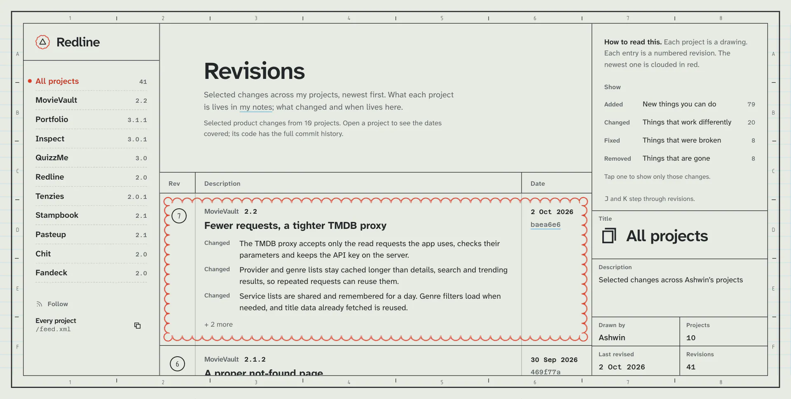
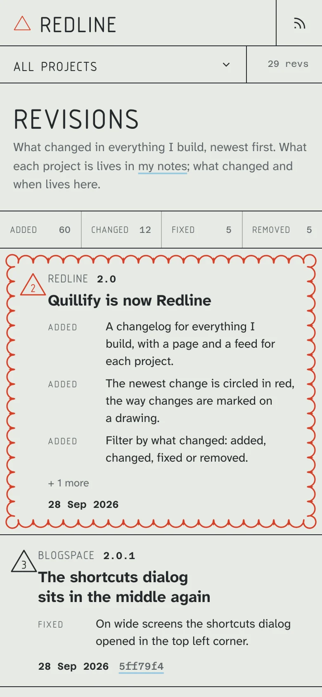
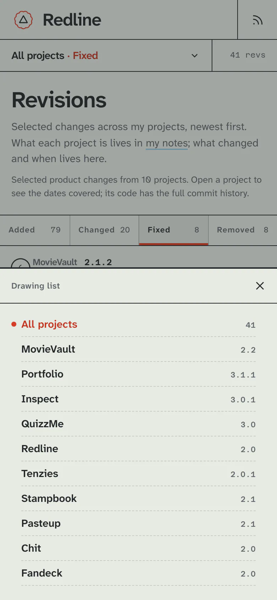
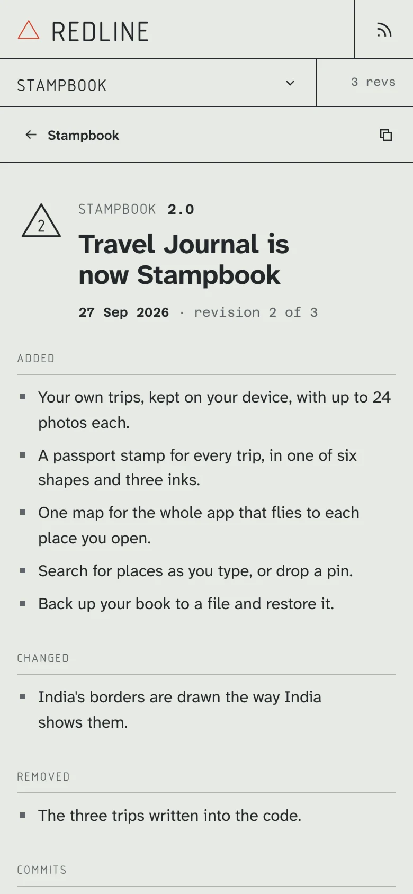
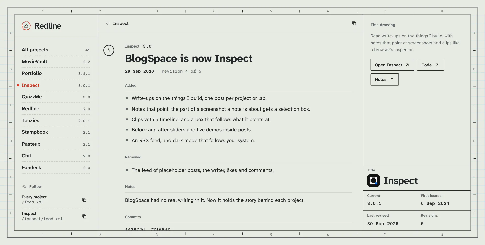
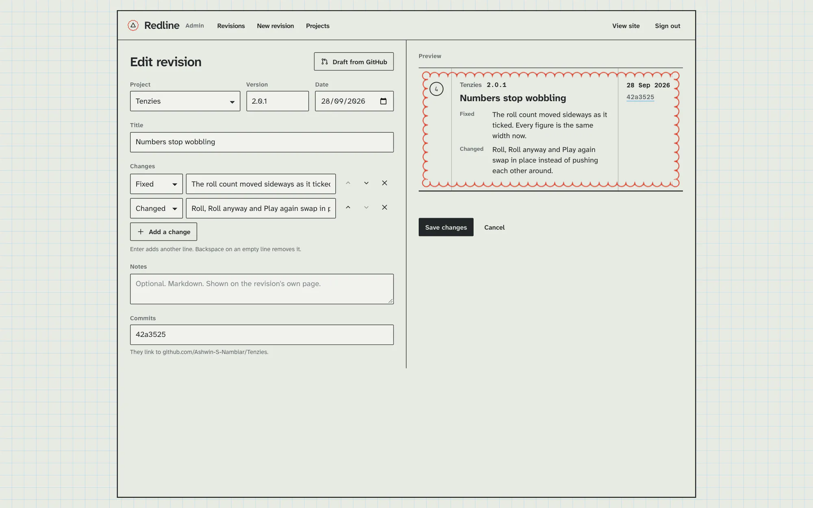
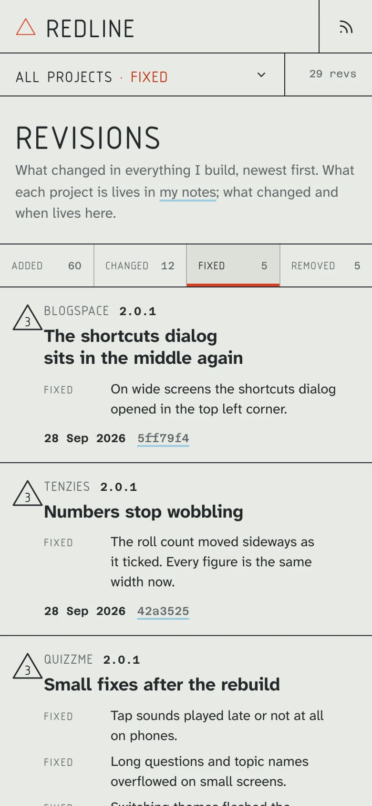
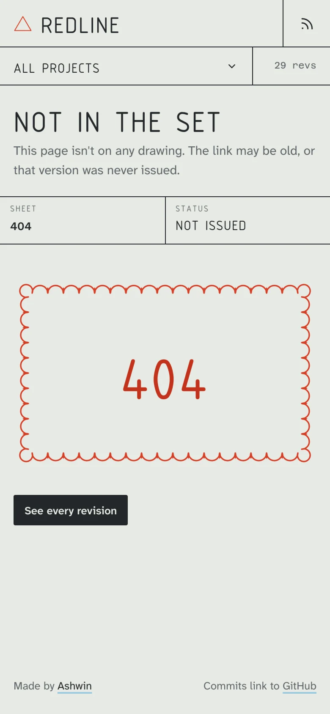

<p align="center">
  <a href="https://redline.ashwin.co.in">
    
  </a>
</p>

<p align="center">
  <a href="https://redline.ashwin.co.in"><strong>redline.ashwin.co.in</strong></a>
  &nbsp;·&nbsp;
  <a href="#what-it-does">what it does</a>
  &nbsp;·&nbsp;
  <a href="#the-design">the design</a>
  &nbsp;·&nbsp;
  <a href="#running-it">running it</a>
</p>

<br>

the source of **[redline.ashwin.co.in](https://redline.ashwin.co.in)**, a changelog of selected changes across my projects, newest first, with what was added, changed, fixed and removed. each project page shows how many revisions are recorded and the dates they cover; github has the full commit history.

this used to be quillify, a blog. blogspace, now inspect, is also a blog, and two was one too many, so this one became the place that keeps track of the rest. the story of each project lives in [my write-ups](https://inspect.ashwin.co.in); what changed and when lives here.

## what it does

<p align="center">
  
  &nbsp;
  
  &nbsp;
  
</p>

- **every project is a drawing.** each one has its own page with what it is, links to the live site, the code and the notes, and its selected revisions.
- **each entry is a revision.** a number in a circle, a version, a date, a title and the changes, sorted into added, changed, fixed and removed. commits link to github.
- **the newest one is clouded.** the latest revision gets a red revision cloud that appears quickly, the way changes are marked on a drawing.
- **show only what you want.** tap added, changed, fixed or removed to see just those changes, across every project or one.
- **feeds.** an atom feed for everything and one for each project. copy the link into any feed reader.
- **keys.** `j` and `k` step through revisions, `enter` opens one, and on a revision `j` and `k` go older and newer while `esc` goes back up.
- **an admin to write them.** sign in, pick a project, and **draft from github** reads the commits since the last release, sorts them by their prefixes and suggests the next version. rewrite them for people, check the live preview, publish. the site updates straight away.

## the design

the page is an engineering drawing.

- **the sheet.** a frame with zone numbers along the edges, drafting film with a pale blue grid, and a title block in the corner with the name, who drew it and when it was last revised.
- **the register.** the revision table from the corner of a drawing, grown into the whole page: rev, description, date.
- **redlining.** on a drawing, changes are marked in red pencil and circled in a scalloped cloud. revision numbers stay graphite so the cloud marks the latest change.
- **type.** atkinson hyperlegible next for names, labels and reading. osifont stays on the frame's zone marks and revision numbers. azeret mono handles versions, dates and commits.
- **no dark mode.** drawings are on film.
- **every screen.** a full sheet on desktop, a narrower sheet on tablets, and on phones the frame goes and the drawing list becomes a sheet you pull up.
- **nothing jumps.** fonts are self-hosted with metric-matched fallbacks, and layout shift measures 0 on load and while you use it.

## the stack

| layer | choices |
| --- | --- |
| app | [next.js 16](https://nextjs.org) and [react 19](https://react.dev) |
| data | [neon](https://neon.com) postgres, over its serverless driver |
| style | [tailwind css 4](https://tailwindcss.com) |
| motion | [motion](https://motion.dev) for sheets and toasts, view transitions between pages |
| auth | [jose](https://github.com/panva/jose) and [bcryptjs](https://github.com/dcodeIO/bcrypt.js) for the admin |
| notes | [marked](https://marked.js.org) |
| type | [osifont](https://github.com/hikikomori82/osifont), [atkinson hyperlegible next](https://www.brailleinstitute.org/freefont/) and [azeret mono](https://github.com/displaay/azeret), self-hosted |
| lint and format | [biome](https://biomejs.dev) |
| hosting | [vercel](https://vercel.com/) |

## running it

```sh
git clone https://github.com/Ashwin-S-Nambiar/Redline.git
cd Redline
npm install
```

make a `.env` with:

```
DATABASE_URL=postgres connection string from neon
JWT_SECRET=any long random string
ADMIN_EMAIL=you@example.com
ADMIN_PASSWORD=a password
```

then:

```sh
npm run seed    # creates the tables and loads the projects and revisions
npm run admin   # creates your admin login from ADMIN_EMAIL and ADMIN_PASSWORD
npm run dev
```

open http://localhost:3000, and http://localhost:3000/admin to write. `npm run check` runs biome. set `GITHUB_TOKEN` too if you draft from github often, since github limits unsigned requests to 60 an hour.

### hosting and indexing

production indexing is configured for `redline.ashwin.co.in`; vercel sends `noindex, nofollow` on other hosts, including preview deployments. the sitemap includes the home page, projects with recorded revisions and every revision page. admin and not-found pages are marked `noindex`. if you deploy under another domain, update the indexing headers and site urls along with it.

## the shape of it

```
app/
  (site)/             the sheet: the register, project pages, revision pages and feeds
  admin/              sign in, the list, the editor and projects, and their server actions
  feed.xml/           the feed for everything
components/           the frame, the rail, a revision row, the title block, sheets, toasts
lib/
  data.js             reads projects and revisions and numbers them
  db.js               the neon client
  feed.js             atom
  session.js          the admin cookie
  tip.js              tooltips
scripts/
  schema.sql          the tables
  seed-data.js        curated revisions so far
public/
  cloud.svg           the revision cloud
```

## known rough edges

- **one admin.** there is one login and no roles; it's my changelog.

<details>
<summary><strong>more screenshots</strong></summary>

<br>





<p align="center">
  
  &nbsp;
  
</p>

</details>

---

[redline.ashwin.co.in](https://redline.ashwin.co.in) · [ashwin.co.in](https://ashwin.co.in) · [notes](https://inspect.ashwin.co.in) · [x](https://x.com/ashwinnambiar11) · [github](https://github.com/Ashwin-S-Nambiar)
